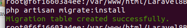

## Bases de datos con Laravel
* Laravel permite tener un control absoluto sobre la estructura de la base de datos.
* Con esto me refiero a que a través del proyecto podemos sobre todas las tablas de nuestro proyecto 
 ** crear
 ** borrar
 ** modificar
 ** poblar 
* Para este cometido está el concepto de las **migraciones** en laravel que son ficheros php que contiene las instrucciones necesarias para realizar estas operaciones

* Ademas usaremos comando de artisan para agilizar el proceso de creación y ejecución de las migraciones
### Configurar la base de datos
*Para configurar la base de datos, hemos de especificar los siguientes parámetros:
 
<ol>
 <li>localhost</li>
 <li>usuario</li>
 <li>password</li>
 <li>base de datos</li>
</ol>

* Como todas las configuraciones, debemos ir al fichero de configuración de bases de datos

  
Si vemos el contenido, vemos que es un array llamado **connections** el cual contiene tantas una serie de conexiones.

Podemos añadir más si necesitáramos, pero para este caso vamos a usar la ya conocida **mysql**

Si accedemos a ese elemento vemos su configuración:
<pre> 
'mysql' => [
        'driver' => 'mysql',
        'url' => env('DATABASE_URL'),
        'host' => env('DB_HOST', '127.0.0.1'),
        'port' => env('DB_PORT', '3306'),
        'database' => env('DB_DATABASE', 'forge'),
        'username' => env('DB_USERNAME', 'forge'),
        'password' => env('DB_PASSWORD', ''),
        'password' => env('DB_PASSWORD', ''),
    //.....
</pre>

Vemos como todos los parámetros, en lugar de asignarle directamente el valor, usamos la función **env**.

Esta función lo que hace es buscar el valor en el fichero *****.env*****, fichero ubicado en la carpeta raíz del proyecto
Si esta función localiza el parámetro que tiene como primer argumento en el fichero, retorna ese valor, si no, se retorna el valor que tiene como segundo argumento

El fichero *****.env***** es un fichero con información un tanto confidencial, por ser un fichero oculto, git no lo subirá al repositorio.

Puede ocurrir que tras una instalación, no tengas en tu directorio raiz el fichdero ***.env***, en este caso siempre tendrás un fichero ***.env.examep***, cópialo como ***.env*** y empieza a configurar las variables que ahí veas
Esto te ocurrirá siempre que hagas un clone de un proyecto laravel, recuerda que en principio , los ficheros ocultos no se suben a git (seguridad). En este caso, recuerda que hay que decir a composer que descargue todas las librerías necesarioas
<pre>
 composer update
</pre> 

Por lo tanto es mejor asignar los valores en el fichero de configuración
<pre>
DB_CONNECTION=mysql
DB_HOST=127.0.0.1
DB_PORT=3306
DB_DATABASE=laravel8BaseDatos
DB_USERNAME=root
DB_PASSWORD=root
</pre>

Ahora debemos de crear la base de datos laravel8basedatos 

### Instalar las migraciones
 https://laravel.com/docs/8.x/migrations

*Una vez creada la base datos vemos que está vacía

 

Ahora lo primero que debemos hacer es instalar las migraciones
 <pre>
 php artisan migrate:install
 </pre>
Y nos crea la migración. con ello se crea una tabla en la base de datos llamada ****migrations**** que va a controlar la gestión de migraciones (las que estén creadas, pendientes de crear, etc)

### Crear una migración para cada tabla
 Ahora vamos a crear una tabla, por ejemplo de ***personas***
 <pre>
 php artisan migration personas
 </pre>    

Esto crea un fichero php con dos métodos : ***up*** y ***down***

 * El método up es el que se ejecutará cuando le diga que ejecute las migraciones
 * El método down es el que se ejecutará cuando le diga que anule las migraciones 

 Ahora toca escribir el código en los métodos, la intención será que en el método up se ejectue la creación de una tabla, y el método down el borrado de la misma

 Podemos con artisna hacer el método up, ya tenga el nombre de la tabla que queremos crear. Es bueno poner el nombre de la tabla en plurar para su relación con el modelo, como veremos posteriormente
  <pre>
  php artisan make:migration persona --create personas 
 </pre>

Ahora vemos que la clase creada  ya tiene código tanto en el método ***up*** como en el método ***down***
<pre>
class Persona extends Migration
{
    /**
     * Run the migrations.
     *
     * @return void
     */
    public function up()
    {
        Schema::create('personas', function (Blueprint $table) {
            $table->id();
            $table->timestamps();
        });
    }

    /**
     * Reverse the migrations.
     *
     * @return void
     */
    public function down()
    {
        Schema::dropIfExists('personas');
    }
}

</pre>

Vemos que aparece la ***facade*** Schema, cuyos métodos básicamente tiene que ver con acciones sobre la base de datos
Aquí puedes ver sus métodos:
 https://laravel.com/api/8.x/Illuminate/Database/Schema/Builder.html

La clase Blueprint presenta los métodos para la gestión de cada columna o nombre de campo, aquí puedes ver todos sus métodos
 https://laravel.com/docs/8.x/migrations#creating-columns

### Ejecutar una migración
 Para gestionar las migraciones, tenemos una serie de utilidades en ***php artisan*** :
<pre>
      migrate      => Ejecuta las migraciones pendientes (las que no se hayan ejecutado)                          
                          
      migrate:install => Instala y crea la tabla migrations                  
      migrate:refresh => Ejecuta los métodos down y luego up de todas las migraciones (rollback - migrate)
      migrate:fresh   => Borra todas las tablas de la base de datos y luego ejecuta migrate
      migrate:reset    => Deshace todas las migraciones ejecutando  sus  métodos down                
      migrate:rollback => Deshace la última migración ejecutando  los métodos down de la última migración                 
      migrate:status   => Nos informa del estado de las migraciones, si hay algo pendiente
</pre>

En nuestro caso vamos a crear la migración 
<pre>
 php artisna migrete
</pre>

Vemos que nos ha creado la tabla en la base de datos.

### Modificar una migración y volver a ejecutarla para que se actualice en la tabla

Supongamos que queremos añadir un campo o cambiar algún tipo de algún campo

Una forma cómoda de hacerlo es realizando el cambio en el fichero de la base de datos

Ahora ejecutamos el método refresh y así se actualizará

### Cómo poblar las tablas

* Una cosa que tiene Laravel es que usa la biblioteca faker https://github.com/fzaninotto/Faker para poder poblar la tabla de forma rápida

* Esto es especialmente útil para poder realizar  pruebas en el desarrollo de la aplicación.

* Para ello vamos a usar clases creadas en  *****factories y seeders***** (ver carpetas en la sección ***database***)
  

### Interaccionar una tabla con una aplicación en laravel

#### Crear un modelo 

#### Crear un modelo con tabla, migración y preparada para ser poblada

#### Visualziar los datos

#### Concepto de resource: un CRUD

#### Guardar datos de un formulario en una tabla

que queramos inco

